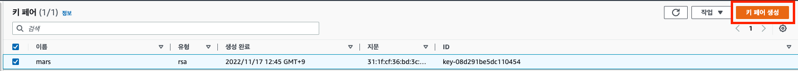
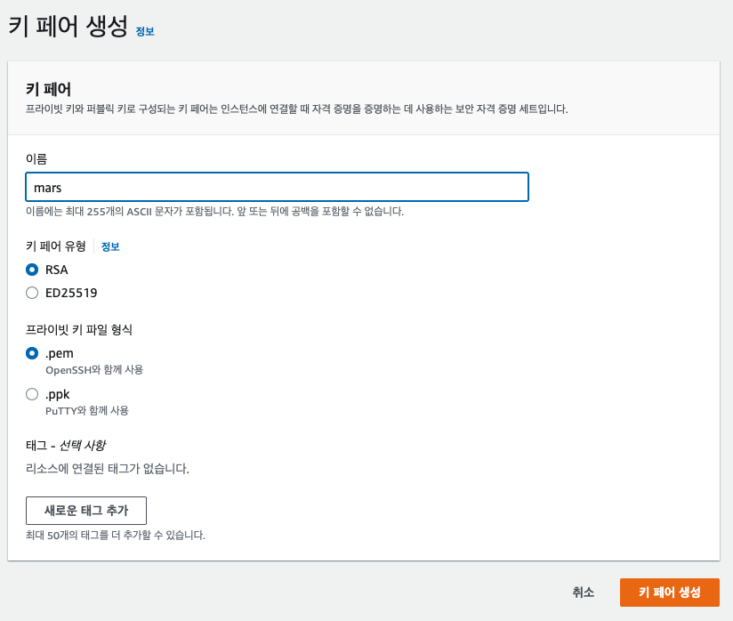
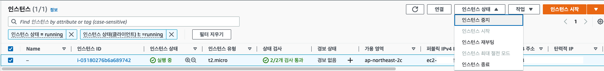
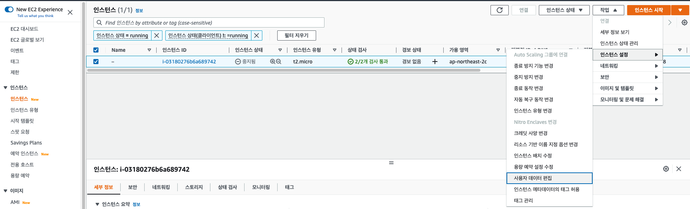
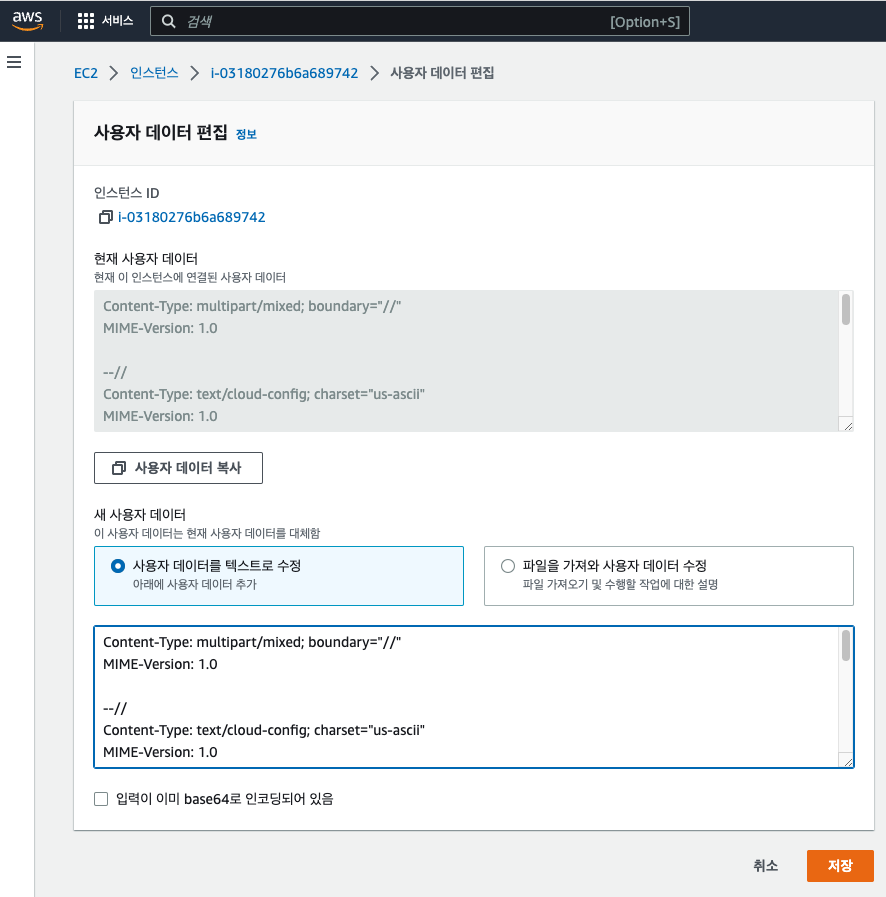
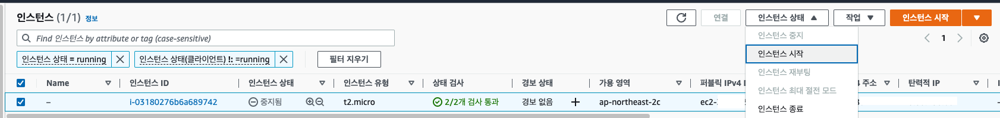

# AWS EC2 private key 재발급


잘 저장해두었다고 생각했던 EC2 private key 가 사라졌다면 어떻게 할까요?

방법은 간단합니다. 키를 **재발급**하고 **새로 등록**하면 됩니다.

아래 절차를 따라가 봅시다.

<br />

<br />

## 1 새로 키 생성

우선 AWS 계정으로 접속한 뒤 

AWS > EC2 > 네트워크 및 보안 > 키 페어

키 페어 생성





- 키페어 유형 - RSA
- 프라이빗 키 파일 형식 - .pem (mac, linux), .ppk (window putty)

키 페어 생성을 누르면, 자동으로 private key (.pem) 파일이 다운로드 됩니다.

<br />

<br />

## 2 인스턴스 중지

중요한 것은 인스턴스 종료가 아닌 '중지'입니다.

- 만일 인스턴스가 모두 종료되고 더 이상 인스턴스가 남아있지 않은 상태에서 탄력적 IP 를 사용 중이면 추가 요금이 부과됩니다.
- 지금은 인스턴스 중지를 하므로 요금부과와는 상관이 없습니다.

아래와 같이 인스턴스를 중지합니다.



<br />

<br />

## 3 사용자 데이터(user data) 편집

AWS > EC2 > 인스턴스 > 인스턴스 로 이동합니다.



- 작업 > 인스턴스 설정 > 사용자 데이터 편집 에 들어갑니다.

<br />

<br />



- 사용자 데이터를 텍스트로 수정
- 아래 빈칸에 아래 내용을 입력합니다.

```shell
Content-Type: multipart/mixed; boundary="//"
MIME-Version: 1.0

--//
Content-Type: text/cloud-config; charset="us-ascii"
MIME-Version: 1.0
Content-Transfer-Encoding: 7bit
Content-Disposition: attachment; filename="cloud-config.txt"

#cloud-config
cloud_final_modules:
- [users-groups, once]
users:
  - name: ec2-user
    ssh-authorized-keys: 
    - ssh-rsa AAAA~~~~~~~~~~~~~~~~~~~~~~~~~~~~~~~~~~~~~~~~~~~~~~~~~~~~~~~~~
```

- `name` 에는 ec2-user 를 입력합니다. 다른 이름을 입력해도 되지만 그 이름을 가진 계정은 sudo 권한이 없게됩니다.

- `ssh-authorized-keys: ` 에 들어갈 내용은 아래와 같이 구합니다.

<br />

다운로드받은 pem 파일에서 공개키를 구합니다.

```shell
# 개인만 read 하는 권한으로 변경
chmod 400 mars.pem
# 공개키 조회
ssh-keygen -y -f mars.pem
ssh-rsa AAAA~~~~~~~~~~~~~~~~~~~~~~~~~~~~~~~~~~~~~~~~~~~~~~~~~~~~~~~~~
```

ssh-rsa 를 포함하는 긴 문자열을 복사해서 위에 처럼 붙여 넣어주시면 됩니다.

그리고 저장버튼을 누릅니다.

<br />

<br />

## 4 인스턴스 시작

이제 인스턴스를 시작하면 새로 발급한 키로 EC2 연결이 가능합니다.



<br />

<br />

```shell
ssh -i mars.pem ec2-user@YOUR_EC2_IP
Last login: Thu Nov 17 19:05:16 2022 from 116.121.73.140

       __|  __|_  )
       _|  (     /   Amazon Linux 2 AMI
      ___|\___|___|

https://aws.amazon.com/amazon-linux-2/
```

- `YOUR_EC2_IP` 자리에 자신의 EC2 인스턴스 IP 를 입력합니다. (탄력적 IP 로 고정 IP를 만들었다면, 탄력적 IP를 입력합니다.)

이제 성공적으로 접속이 완료됩니다.

<br />

<br />

참고) 위 명령어가 번거롭다면 아래와 같이 설정하면 됩니다.

```shell
vi ~/.ssh/config
```

```shell
Host mars
  HostName YOUR_EC2_IP
  User ec2-user
  IdentityFile ~/.ssh/aws/mars.pem
```

- HostName 에는 자신의 EC2 IP 를 넣어주시면 됩니다.
- IdentityFile 에 pem 파일의 경로를 넣어주시면 됩니다.

```shell
ssh mars
Last login: Thu Nov 17 19:47:43 2022 from 116.121.73.140

       __|  __|_  )
       _|  (     /   Amazon Linux 2 AMI
      ___|\___|___|

https://aws.amazon.com/amazon-linux-2/
```

<br />

<br />

## 5 사용자 데이터를 한 번 더 수정하고 싶다면?

사용자 데이터 편집에 입력된 데이터는, 최초 한 번만 실행이 됩니다.

따라서 인스턴스 중지 후, 사용자 데이터 편집에 들어가서 이미 편집한 내용에 대해 

(예를들어) 다른 공개키로 바꾸고 다시 수정하고 저장하면 EC2 에 반영되지 않습니다.

이 때는 아래부분을 `always` 로 바꾸어서 저장하면 해결이 됩니다. 

```shell
...

#cloud-config
cloud_final_modules:
- [users-groups, always]
users:
  - name: ec2-user
    ssh-authorized-keys: 
    - ssh-rsa new~~~~~~~~~~~~~~~~~~~~~~~~~~~~~~~~~~~~~~~~~~~~~~~~~~~~~~~~~~~~
```

- 이렇게 한 후 인스턴스를 시작하면 EC2 에 반영됩니다.
- 이후에는 다시 `once` 로 바꾸어 놓으시면 됩니다.

<br />

<br />

<br />

참고) AWS 공식 문서

https://aws.amazon.com/ko/premiumsupport/knowledge-center/user-data-replace-key-pair-ec2/

https://docs.aws.amazon.com/AWSEC2/latest/UserGuide/describe-keys.html#retrieving-the-public-key

https://aws.amazon.com/ko/premiumsupport/knowledge-center/execute-user-data-ec2/

<br />

<br />

<br />

<br />

<br />
