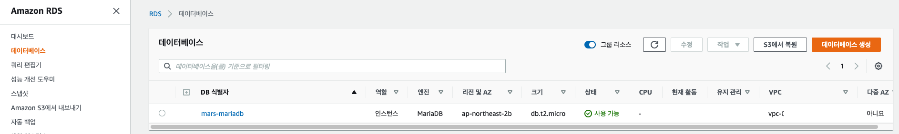

# AWS RDS 생성, EC2 연결하기

RDS 는 Relational Database Service 의 약자이고, 

AWS 클라우드에서 관계형 데이터베이스를 손쉽게 설치, 운영하고 확장할 수 있는 웹 서비스입니다.

하드웨어 장비설정, 데이터베이스 설정, 백업 등 운영 작업을 AWS 에서 관리할 수 있습니다.

<br />

<br />

# 1 RDS 생성

여기서는 AWS free-tier 계정에 맞게 추가요금이 발생되지 않도록 RDS 를 생성합니다.

AWS > RDS 검색 > 대시보드 > 데이터베이스 생성


- MariaDB 를 사용했습니다. 프리티어에서 사용가능합니다.
  - MySQL, PostgreSQL 도 프리티어에서 가능합니다.

<br />


인스턴스 식별자와, 자격 증명 설정을 입력합니다.

- AWS는 db.t2.micro, db.t3.micro, db.t4g.micro 에 대해 프리티어가 가능함을 명시하고 있지만 저는 테스트 성격상 가장 낮은 성능의 하드웨어를 적용했습니다.

<br />


<br />

AWS RDS 의 프리티어 무료 용량은 20GB 입니다. 따라서 그에 맞게 적용해줍니다.


<br />


퍼블릭 액세스는 '예' 로 설정하여, 외부에서도 데이터베이스에 로그인을 통해 접근할 수 있도록 설정을 변경하겠습니다.

보안 그룹은 기본은 default 로 지정이 되는데, EC2 와 연결을 하기 위한 저만의 보안그룹을 새로 만들었습니다. 이 부분은 `2 보안그룹 지정` 에서 다루겠습니다. default 로 하시고 나중에 수정하셔도 됩니다.

<br />


데이터베이스 이름을 정해서 하나 만들어주고 RDS 를 생성합니다.

나머지 설정은 그대로 했습니다.

<br />

<br />

<br />



위와 같이 RDS 인스턴스가 생성되었습니다.

# 2 보안그룹 지정


EC2 > 보안 그룹 에 들어가면, 새로운 보안 그룹을 생성할 수 있습니다.

새로운 보안 그룹을 만들고, 인바운드 규칙을 편집합니다. 

외부에서 RDS 인스턴스 3306 포트로 들어오는 트래픽 유입에 대한 규칙을 지정해줍니다.

- 첫번째는 제가 로컬에서 접근할 수 있도록 내 IP 를 추가합니다.
- 두번째는 EC2 에 지정된 보안그룹 ID 를 추가합니다.
  - EC2 가 여러 대일 수 있으므로, 각 EC2에 공통적으로 적용된 보안 그룹을 지정해주면 관리가 수월합니다.


<br />

<br />

# 3 EC2 에서 연결

EC2 에서 RDS 가 연결되는지 보기 위해 , mysql 을 다운로드 합니다.

```shell
sudo yum install mysql
```

- mariadb 도 mysql 로 연결 확인 가능합니다.

<br />

```shell
mysql -u mars -p -h mars-mariadb.cwvsx72yn2vt.ap-northeast-2.rds.amazonaws.com
Enter password:
Welcome to the MariaDB monitor.  Commands end with ; or \g.
Your MariaDB connection id is 27
Server version: 10.6.10-MariaDB managed by https://aws.amazon.com/rds/

Copyright (c) 2000, 2018, Oracle, MariaDB Corporation Ab and others.

Type 'help;' or '\h' for help. Type '\c' to clear the current input statement.
```

- -u (user) : mysql 계정이름
- -p (password) : 명령어 입력시 뒤에 비밀번호를 입력하는 절차가 생김
- -h (host) : 접속할 db 호스트명


<br />

<br />

<br />

<br />

<br />

