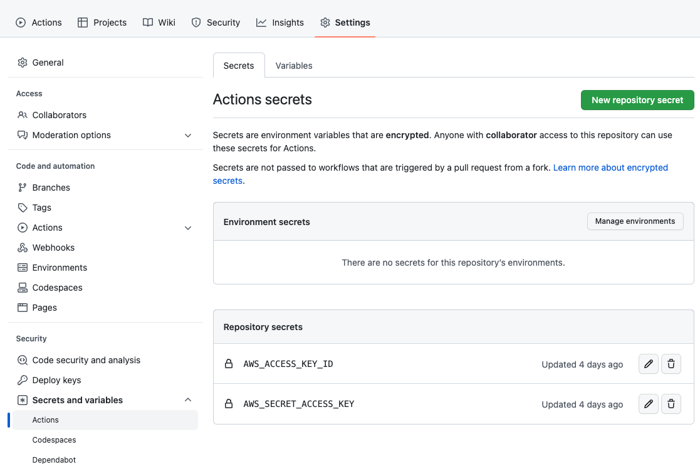
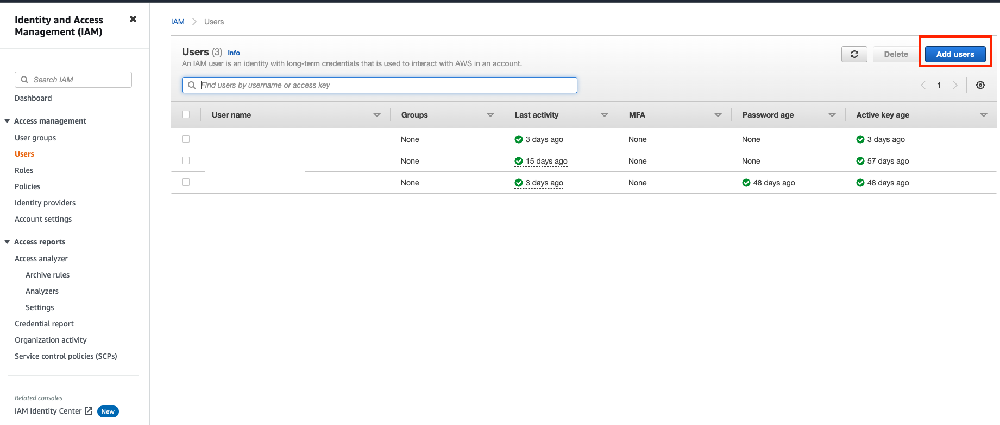
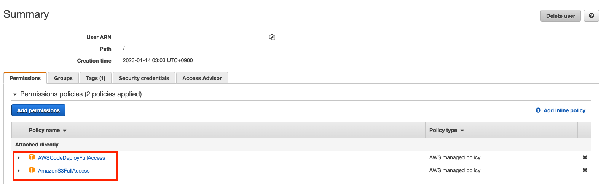
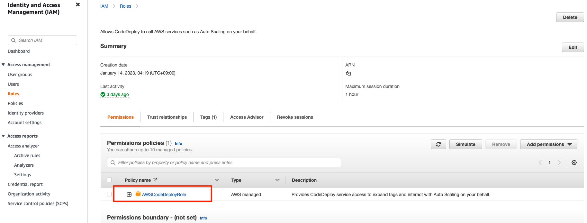
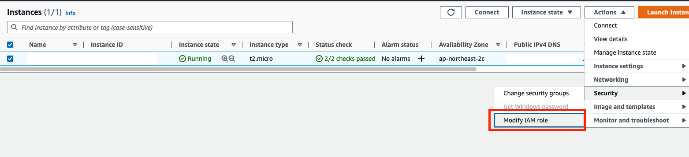
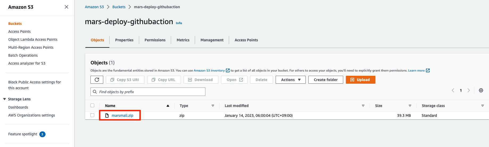
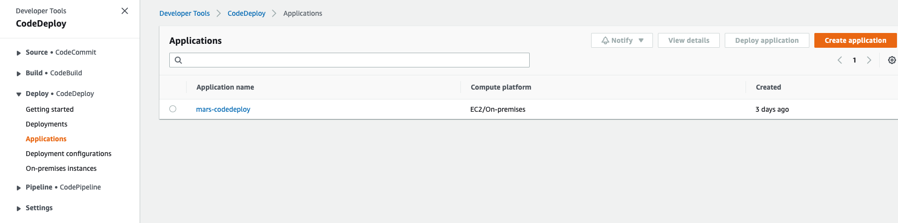

# Github Actions EC2 자동 배포 with S3, CodeDeploy


# 문제

[https://wordbe.tistory.com/309](https://wordbe.tistory.com/309) 에서 self-hosted 를 이용해서 자동배포를 구축해보았다.

하지만 self-hosted 로 EC2 를 사용하는 것은 구성은 쉽지만, 빌드시 EC2 서버의 메모리를 잡아먹는다. 또한 action-runner 도 실행시켜 놓아야 한다.

free tier 는 t2.micro 사양을 제공하고 RAM 이 1GB 이므로 `gradlew build` 에서 메모리 부족으로 실패하는 경우가 자주 발생했다.

<br />

# 빌드를 Github Actions 에서

Github Actions 는 월 2000 분의 무료 사용량을 제공한다.

따라서 Github Actions 서버를 사용하면 월 33시간 정도 = 하루 약 1시간 정도의 자원을 무료로 사용할 수 있다.

참고 : [https://docs.github.com/en/billing/managing-billing-for-github-actions/about-billing-for-github-actions](https://docs.github.com/en/billing/managing-billing-for-github-actions/about-billing-for-github-actions)

<br >

빌드를 완료했으면 결과 jar 파일과 몇몇 스크립트를 내 EC2 서버로 옮겨주어야 한다.

AWS S3 에 이 파일들을 옮긴다.

그 다음 AWS CodeDeploy 가 S3 파일을 EC2 에 가져가도록 한 후 내가 작성한 배포스크립트를 실행하도록 할 것이다.

Github Actions 스크립트를 먼저 확인해보자.

<br />

**.github/workflows/main.yml**

```yaml
on:
  push:
    branches:
      - main

env:
  APP_NAME: marsmall
  AWS_REGION: ap-northeast-2
  AWS_S3_BUCKET: mars-deploy-githubaction
  AWS_S3_BUCKEY_KEY: marsmall.zip

jobs:
  build:
    runs-on: ubuntu-22.04

    defaults:
      run:
        working-directory: ${{ env.APP_NAME }}
    steps:
      - name: Checkout
        uses: actions/checkout@v3

      - name: Set up JDK 17
        uses: actions/setup-java@v3
        with:
          distribution: 'zulu'
          java-version: '17'
          cache: 'gradle'

      - name: Execute gradle build
        run: |
          chmod +x gradlew
          ./gradlew build --no-daemon -x test
      - name: Copy deploy files and zip
        run: |
          cp ./build/libs/$APP_NAME-0.0.1-SNAPSHOT.jar ./deploy
          zip -r -qq ./$AWS_S3_BUCKEY_KEY ./deploy
      - name: Configure AWS Credentials
        uses: aws-actions/configure-aws-credentials@v1
        with:
          aws-access-key-id: ${{ secrets.AWS_ACCESS_KEY_ID }}
          aws-secret-access-key: ${{ secrets.AWS_SECRET_ACCESS_KEY }}
          aws-region: ${{ env.AWS_REGION }}
      
      - name: Deliver to AWS S3
        run: aws s3 cp --acl private ./$AWS_S3_BUCKEY_KEY s3://$AWS_S3_BUCKET/
      
      - name: AWS CodeDeploy
        run: |
          aws deploy create-deployment \
          --application-name mars-codedeploy \
          --deployment-group-name mars-githubaction-s3-codedeploy \
          --s3-location bucket=$AWS_S3_BUCKET,bundleType=zip,key=$AWS_S3_BUCKEY_KEY
```

- `runs-on: ubuntu-22.04` : 우분투 22.04 버전의 깃헙 액션 서버를 사용한다. 안정성을 위해 고정 버전을 사용했다.

- `uses: actions/checkout@v3` : 내 코드를 워크플로가 가져온다.

- `uses: actions/setup-java@v3` : 자바를 사용하므로 해당 세팅을 가져온다. 이 때 파일이 존재하면 캐시를 사용해 속도를 높인다.

- `name: Execute gradle build` : gradle 를 빌드한다. 정상적으로 끝나면 결과 jar 파일이 나온다.

- `name: Copy deploy files and zip` : jar 파일과 준비해놓은 스크립트파일을 하나의 `zip` 파일로 만든다. (S3 에는 zip 파일이 허용됨)

- `uses: aws-actions/configure-aws-credentials@v1` : AWS 에 로그인한다.
  - IAM 을 통해 미리 사용자를 만들어 access key id 와 secret access key 를 받아 놓는다.
  
  - 받아놓은 키를 Github > Settings > Secrets and variables > Actions 에 등록해놓는다.
  
    
  
  - region 은 위에 환경변수로 따로 적용해주었다. (`AWS_REGION: ap-northeast-2`)
  
- `run: aws s3 cp --acl private ./$AWS_S3_BUCKEY_KEY s3://$AWS_S3_BUCKET/` 

  - s3 로 업로드한다.
  - 접근제어목록 설정은 private 으로 하여 공용접근을 막는다.
  - AWS_S3_BUCKEY_KEY 이 파일을 `s3://$AWS_S3_BUCKET/` 이 위치(s3) 아래 옮길 것이다.

- `run: aws deploy create-deployment...`

  - AWS CodeDeploy 로 S3 파일을 EC2 로 옮긴다.
  - AWS CodeDeploy 에 미리 application-name, deployment-group-name 를 만들어 놓는다.
  - 파일을 가져올 s3-location 을 명시해준다.


<br />

# AWS IAM





위와 같이 AWSCodeDeployFullAccess, AmazonS3FullAccess 정책을 추가해준 사용자를 만든다.

이는 Gihtub Actions 에서 위 사용자로 로그인해서 `aws s3`, `aws deploy` 명령을 사용하기 위함이다.

여기서 생성된 access key id 와 secret access key 를 깃헙 세팅 시크릿에 등록해주면 된다.

<br />


또한 EC2 에 CodeDeploy agent 를 다운받아 사용할 것인데 EC2 에 Roles 를 부여해서 자동 인증하여 CodeDeploy 를 연동할 수 있도록 아래 Roles 를 만들어준다.



그리고 생성한 Role 을 EC2 에 등록해준다. 



등록 후 EC2를 재부팅 해준다. Instance state > Reboot Instance 를 누르면 된다.<br />

<br />

# AWS S3



AWS S3 는 free tier 에서 5GB 까지 무료로 제공한다.

S3 에서 원하는 버킷명으로 버킷을 생성해준다. 다른 설정 없이 기본설정으로 생성했다.

깃헙 액션이 정상적으로 실행된다면, zip 파일이 S3 버킷에 정상적으로 복사될 것이다.


<br />

# AWS CodeDeploy

코드디플로이를 등록해준다. EC2 에 등록하여 사용한다면 무료로 사용할 수 있다.



<br />

이제 중요한 것은 코드디플로이가 깃헙액션에서 명령하여 실행되었을 때, EC2 의 정해진 위치에 파일이 옮겨질 텐데 그 때 부가적인 동작을 `appspec.yml` 에서 정의할 수 있다.

**appspec.yml**

```yaml
version: 0.0
os: linux
files:
  - source: /
    destination: /home/ec2-user/marsmall/deploy
    overwrite: yes

permissions:
  - object: /
    pattern: "**"
    owner: ec2-user
    group: ec2-user

hooks:
  ApplicationStart:
    - location: scripts/springboot.sh
      timeout: 60
      runas: ec2-user
```

- 현재 S3 에 있는 모든 파일을 destination 장소에 복사하고, 만약 존재하면 덮어씌운다. (`overwrite: yes`)
- `permissions:` : ec2-user 에게 권한을 부여한다.
- `ApplicationStart` 를 통해 내가 만든 `springboot.sh` 파일을 실행시켜준다.

<br />

**springboot.sh**

```shell
#!/bin/bash

PROJECT=marsmall
PROFILE=prod

# 1)
CURR_PID=$(pgrep -f ${PROJECT}.*.jar)
if [ -n "$CURR_PID" ]; then
  echo "already running java process ---> kill -15 $CURR_PID"
  kill -15 "$CURR_PID"
  sleep 8
fi

# 2)
JAR="$HOME/$PROJECT/deploy/marsmall-0.0.1-SNAPSHOT.jar"
JVM_OPTIONS="-Dspring.profiles.active=$PROFILE -Dspring.config.import=file:$HOME/$PROJECT/secret/config.yml"
LOG_PATH="$HOME/$PROJECT/$PROJECT.log"

echo "application started: $JAR"
echo "nohup "java -jar "$JVM_OPTIONS" "$JAR"" > ""$LOG_PATH"" 2>&1 &"
echo "log path: $LOG_PATH"

# 3)
# When nohup errors, output errors to log file
nohup /bin/bash -c "java -jar $JVM_OPTIONS $JAR" > "$LOG_PATH" 2>&1 &
```

- `1)` : 자바 애플리케이션이 이미 실행중인지 확인하고, 실행중이면 우아하게 죽인다. `kill -15`
- `2)` : jar 파일 위치, jvm options, log 경로를 설정해준다.
- `3)` : 자바 애플리케이션을 실행한다. 
  - `nohup` : 터미널을 종료해도 해당 명령어가 지속될 수 있게 한다.
  - `/bin/bash -c "문자열"` 명령어는 해당 문자열을 명령어로 그대로 사용할 수 있도록 평가(evalutation) 해준다.
  - `> "$LOG_PATH" 2>&1` 로깅 결과를 log 경로에 표준출력으로 담는다. 에러가 발생해도 로그가 남는다.
    - 다른 로깅 시스템을 마련하지 않아 일단 이렇게 로깅해놓았다.
  - `&` : 백그라운드에서 실행시킨다.

<br />

이제 준비가 완료되었으니, 변경사항을 `main` 브랜치에 푸시하면 Github Actions 를 통해 자동으로 배포할 수 있다.

<br />

