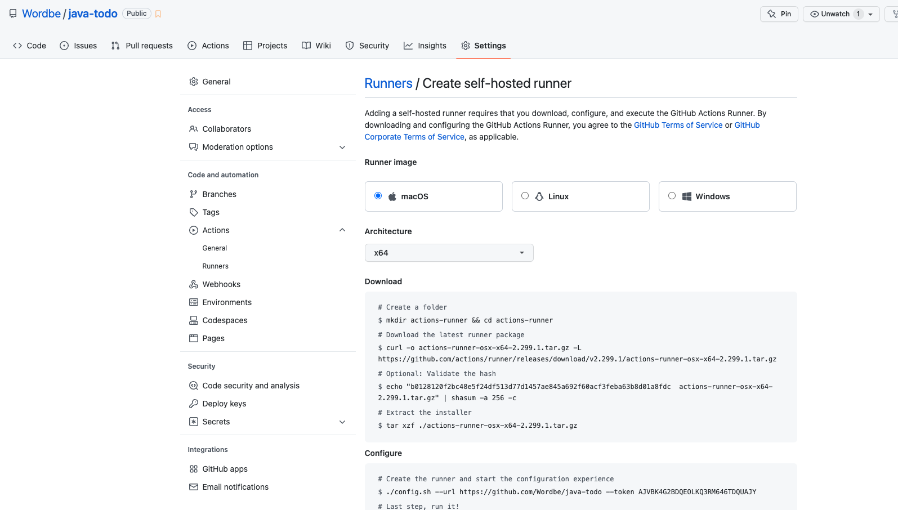
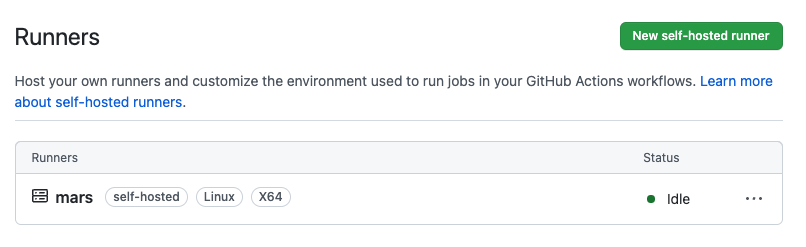
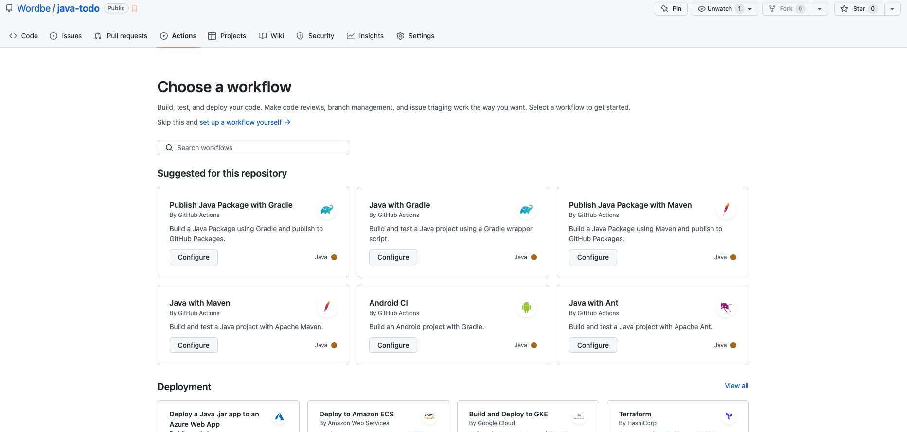
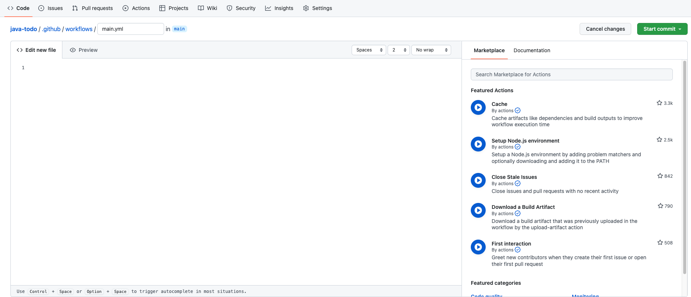
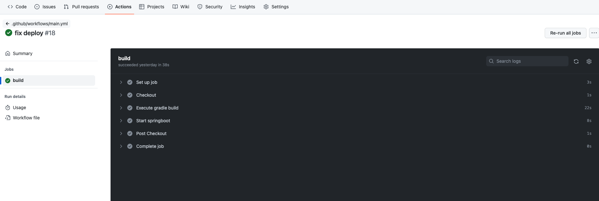
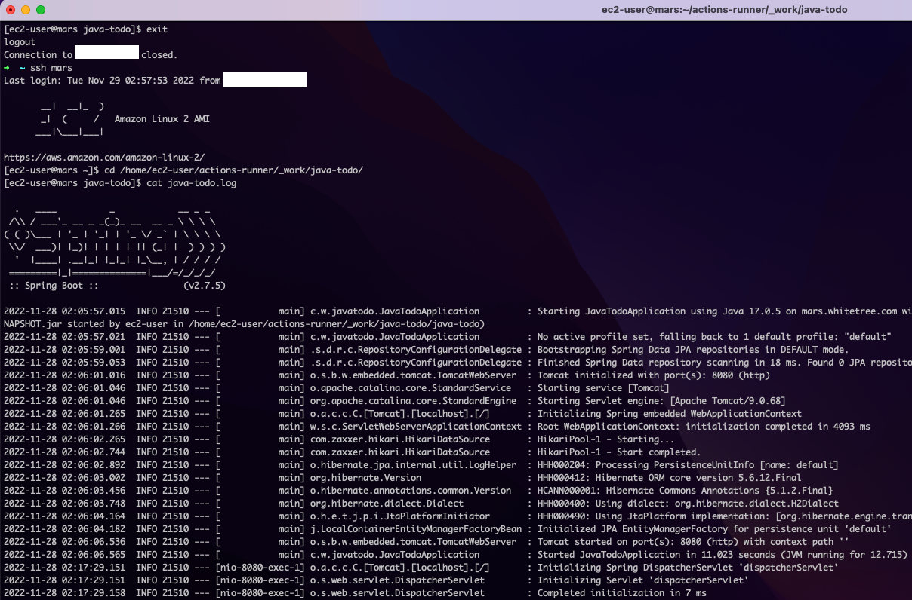

# Github Actions EC2 자동 배포


깃헙 액션을 통해 자동으로 빌드, 테스트, 배포를 진행할 수 있습니다.

다양한 상황의 이벤트에 워크플로우를 진행할 수 있는데, 특정 브랜치에 코드가 푸시되었을 때, 정해진 스케쥴에, 또는 외부에서 이벤트가 발생했을 때 (dispatch webhook 을 사용해서) 등등의 경우 CD(Continous Deployment) 가 진행되도록 할 수 있습니다.

<br />

이 글에서는 github action 과 AWS EC2 서버만 가지고, **간단하게** (main 브랜치에 푸시될 때) 자동으로 배포할 수 있는 설정을 만들어봅니다.

<br />

준비물로는 우선 간단한 스프링부트 프로젝트를 만들었고, `./gradlew build` 명령어로 jar 파일을 추출가능한 상태입니다.

<br />

## 1. Actions 에 EC2 연결



Github actions 에서 self-hosted 로 나의 서버를 사용하고 싶다면, 내 서버에 들어가서 `action runner` 를 설치해주면 됩니다.

- 나의 레포지토리 > Settings > Actions > Runners
- 설치방법은 깃헙에서 위 이미지처럼 친절하게 알려주므로 복사해서 따라하시면 됩니다.



연결이 성공되면 위와 같이 `idle` 상태로 서버가 연결됩니다.

<br />

<br />

## 2. Actions 스크립트 생성

깃헙 레포지토리에 들어가서, Actions 를 클릭합니다.

<br />



그럼 위와 같이 여러 기본 포맷들이 나오는데, 저는 `self-hosted` 를 이용해서 배포하고 싶으니 아래와 같이 만들겠습니다.

set up a workflow yourself 누르시면 됩니다.



<br />

**main.yml**

```yaml
on:
  push:
    branches:
    - main

jobs:
  build:
    runs-on: self-hosted
    permissions:
      contents: read
      packages: write
      
    steps:
    - name: Checkout
      uses: actions/checkout@v3

# use only when first execute
#    - name: Setup java
#      uses: actions/setup-java@v3
#      with:
#        distribution: 'temurin'
#        java-version: '17'
#        cache: 'gradle'
  
    - name: Execute gradle build
      run: ./gradlew build --no-daemon -x test

    - name: Start springboot
      run: |
           RUNNER_TRACKING_ID="" # Prevent the github action from cleaning up orphan processes (background)
           chmod +x ./scripts/springboot.sh
           timeout 300s ./scripts/springboot.sh
```

`on.push:` 설정으로 main 브랜치에 푸쉬되는 이벤트가 트리거역할을 하여 깃헙 액션을 실행하도록 했습니다.

<br />

`runs-on` 에 self-hosted 를 입력하면, 내 서버를 직접 이용할 수 있습니다.

- 내 서버를 레포지토리에 등록하려면 레포지토리 settings > Actions > Runners 에 들어가서 설정하면 됩니다.

<br />

`steps` 에서는 워크플로우에서 차례로 할 내용들을 서술해주시면 됩니다.

- 첫번째로 github 레포지토리를 받아옵니다. (checkout) 이 때 이미 누군가 만들어놓은 코드를 사용 `uses` 하면 됩니다.
- 두번째로는 java 를 설치합니다. 이 부분은 사용하시는 자바 버전에 맞게 명시하시면 됩니다. 저는 termurin java 17 버전을 사용했습니다. 추가적으로, 이미 서버에 자바가 다운로드된 상태라면 해당 스텝은 더이상 할 필요가 없으므로 두번째 시도부터는 제거해도 된다고 판단했습니다. 이로서 실행시간을 1분정도 줄일 수 있었습니다.
- 세번째는 코드를 빌드하고 jar 파일을 생성합니다.
- 네번째로는 제가 만든 배포 스크립트를 실행합니다. `RUNNER_TRACKING_ID=""`  이 부분을 넣은 이유는 깃헙 액션이 맨 마지막 스텝에 백그라운드에서 실행되는 고아 프로세스를 자동으로 죽이도록 설정해놓았기 때문에, 제가 백그라운드에 실행시켜놓은 스프링부트 서버가 죽는 현상을 막기 위함입니다.
  - 실행 권한을 부여하고, 해당 스크립트를 실행합니다. 이 때 5분(300초)이 지나면 타임아웃이 되어 종료하게 설정해놓았습니다. 깃헙액션은 1달에 33시간 정도의 무료시간을 제공해줍니다. 이 것이 초과되는 것을 미리 방지하고자 합니다.

<br >

<br >

아래 스크립트는 제 자바 프로젝트의 최상위경로에 아래 파일을 두어 만들었습니다. 이렇게 되면 깃헙액션에서 checkout 할 때 아래 파일도 같이 서버로 가져오게 되므로, 스크립트를 서버에서 실행할 수 있습니다.

**./scripts/springboot.sh**

```shell
#!/bin/bash

REPO=/home/ec2-user/actions-runner/_work/java-todo
PROJECT=java-todo

CURR_PID=$(pgrep -f ${PROJECT}.*.jar)
if [ -n "$CURR_PID" ]; then
  echo "already running java process ---> kill -15 $CURR_PID"
  kill -15 "$CURR_PID"
  sleep 8
fi

# extract the largest size jar
JAR=$(ls -S $REPO/$PROJECT/build/libs/*.jar | head -n 1)

echo "application start: $JAR"
echo "log path: $REPO/$PROJECT.log"

# When nohup errors, output errors to log file
nohup java -jar "$JAR" > $REPO/$PROJECT.log 2>&1 &
```

깃헙액션이 실행되면, 위에서 설치했던 actions-runner 폴더 하위의 `_work/${프로젝트_이름}` 에 레포지토리의 파일들이 checkout 됩니다.

깃헙액션 스크립트에서 `./gradlew build` 를 수행했으므로, 이 경로 하위의 `build/libs/` 에 jar 파일이 생성됩니다.

<br />

스크립트는 이미 실행중인 스프링부트 프로젝트가 있다면 종료(kill)시킨 다음, jar 파일을 nohup 을 통해 백그라운드에서 실행하는 로직이 담겨있습니다. 결과에는 애플리케이션 로그를 남깁니다.

<br />

<br />

이제 main 브랜치에 해당 코드를 푸시하는 순간 깃헙 액션이 동작합니다. 



그리고 서버에 프로젝트가 배포되고 실행된 것을 확인하실 수 있습니다.



<br />

<br />

<br />

<br />

<br />

<br />

<br />
