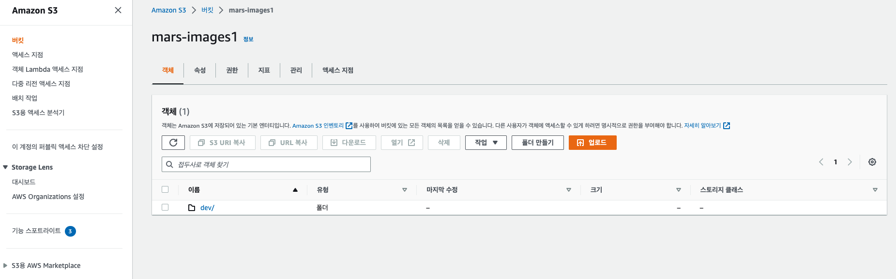
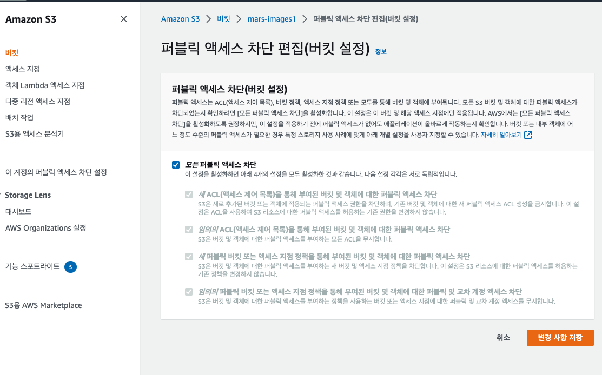
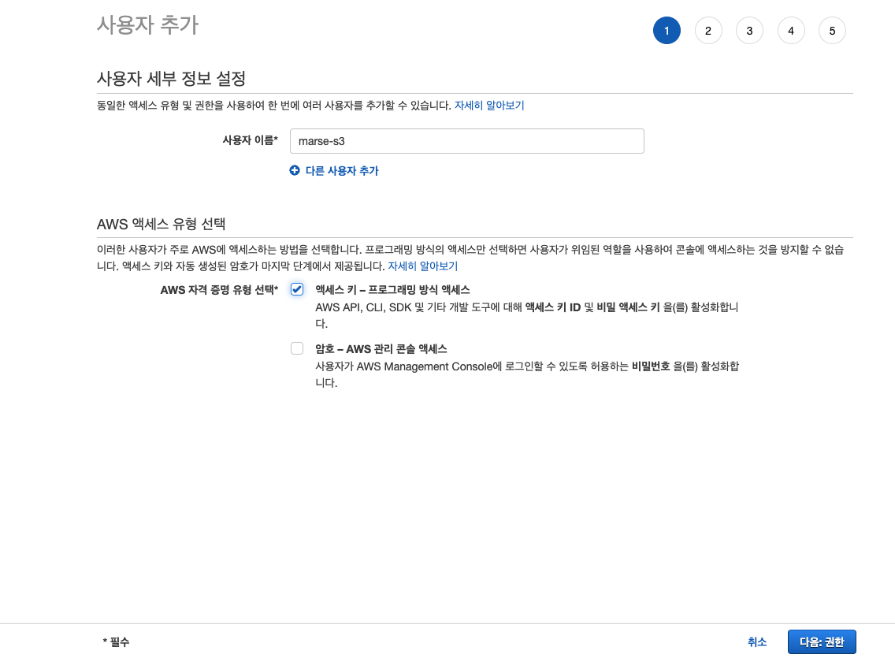
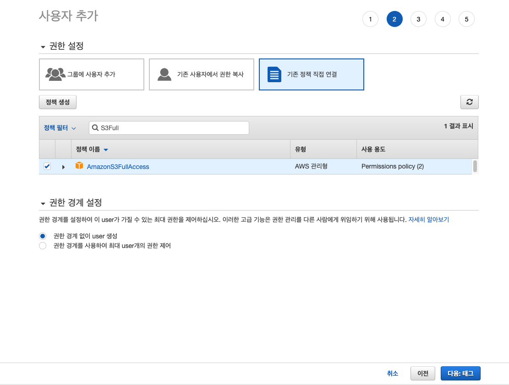
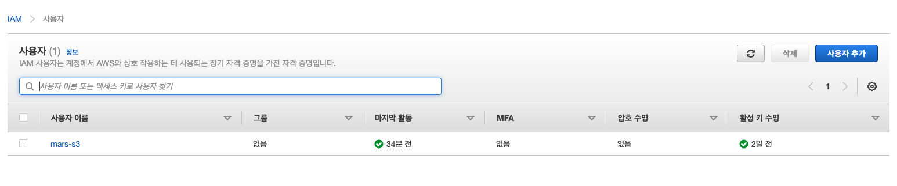
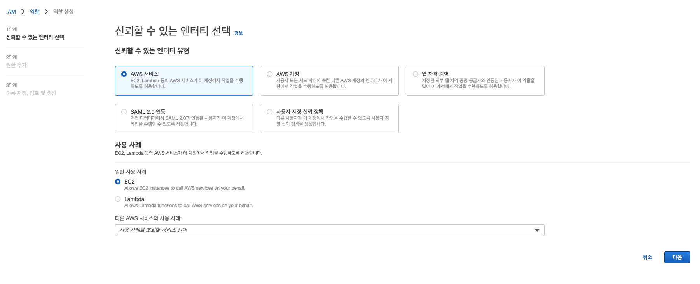
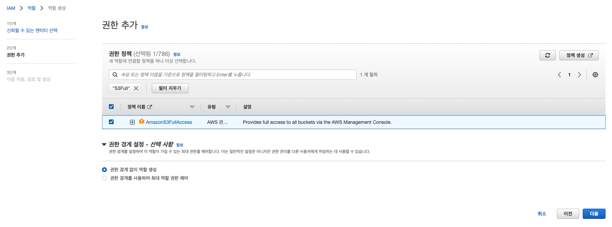
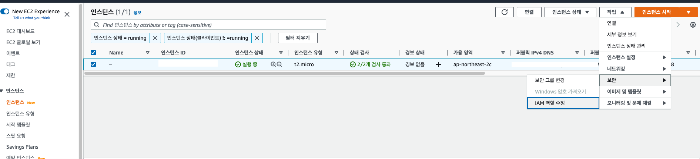
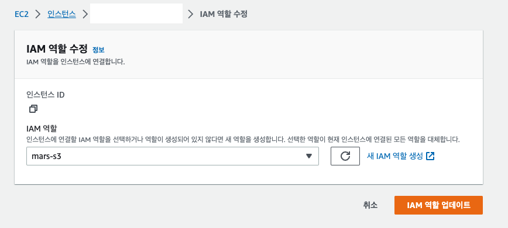
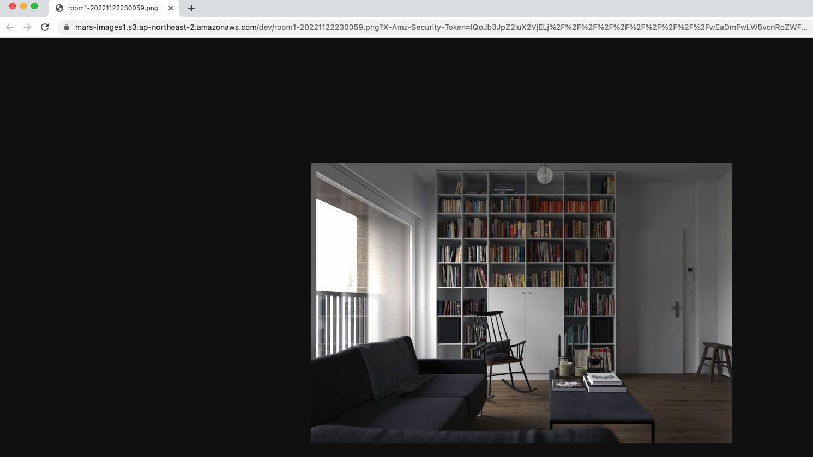

# S3 presigned url, Springboot 연동


이미지를 저장하고, 조회하는 역할로 클라우드 서비스(AWS S3)를 활용하면 이점이 많다.

- 이미지 저장소를 직접 구축하지 않아도 된다.
- 파일 접근 권한을 손쉽게 설정할 수 있다. 모두 접근가능하게도 할 수 있고, 특정 권한을 가진 사용자만 접근가능하게도 할 수 있다.
- 데이터 전송 속도를 관리할 수 있다. (전송 가속화)
- 저장소를 쉽게 모니터링 할 수 있다.
- 저장소 안정성이 높다. 믿고 맡길 수 있다.


<br />

파일 저장소를 S3 로 선택했다면, 이미지를 어떤 방식으로 저장하고 조회할 것인지 고민이 된다.

여기서는 presigned url 을 통해, 이미지를 업로드하고 조회하는 방식을 알아본다.


<br />

## 1) S3 버킷 준비



[AWS S3](https://s3.console.aws.amazon.com/s3/buckets?region=ap-northeast-2) 에서 버킷을 생성하고, 폴더까지 만들어 놓았다.

버킷과 그 안에 object 들에 대해 모두 퍼블릭 접근을 차단한 상태이다.



이제 presigned url 이라는 권한이 주어진 임시 URL 을 통해 파일을 내 버킷에 업로드해보자.

<br />

<br />

## 2) aws-java-sdk 등록

```groovy
implementation platform('com.amazonaws:aws-java-sdk-bom:1.12.347')
implementation 'com.amazonaws:aws-java-sdk-s3'
```

`build.gradle` 에 위 두가지 라이브러리를 등록해 받아온다.

`aws-java-core` 를 받아오면 S3 말고도 관련된 모든 sdk 를 가져올 수 있다. 하지만, s3 만 필요하므로 해당 라이브러리와 의존성 버전관리를 도와주는 bom 을 가져왔다.

<br />

## 3) 업로드용 Presigned URL 가져오기

```java
@Component
public class S3Client {
    private static final String BUCKET = "mars-images1";
    private static final int PRESIGNED_GET_URL_EXPIRATION_DAYS = 1;
    private static final int PRESIGNED_PUT_URL_EXPIRATION_MINUTES = 5;

    private final AmazonS3 amazonS3;

    public S3Client() {
        this.amazonS3 = AmazonS3ClientBuilder.standard()
                .withRegion(Regions.AP_NORTHEAST_2)
                .withCredentials(new ProfileCredentialsProvider())
                .build();
    }

    public String getUploadImageUrl(String filename, LocalDateTime requestAt) {
        Date expiredAt = LocalDateTimeUtils.toDate(requestAt.plusMinutes(PRESIGNED_PUT_URL_EXPIRATION_MINUTES));
        return presignedUrl(filename, expiredAt, HttpMethod.PUT);
    }

    private String presignedUrl(String filename, Date expiredAt, HttpMethod httpMethod) {
        return amazonS3.generatePresignedUrl(BUCKET, filename, expiredAt, httpMethod).toString();
    }
}
```

- `AmazonS3` 인터페이스의 `generatePresignedUrl` 를 통해 presigned url 을 가져올 수 있다.
- 어느 버킷에서 가져올지 결정해야 하기 때문에, 버킷 이름과 버킷에 접근할 수 있는 권한이 필요하다.
  - 위 코드에서 버킷이름은 그냥 적어주었고, 로컬에서 버킷 권한은 `~/.aws/credentials` 파일에 담아놓았다.
- 버킷에서 이미지를 불러 올 key 로 filename 을 넣어주었다. `my_image-20221124T012000.png` 처럼 시간을 넣으면 어느정도 중복없는 파일명을 만들 수 있을 것이다.
- 만료기한을 넣어야하는데 다른 사람이 이 url 을 만약 가지고 업로드하면 안되니 짧게 5분정도로 설정해 놓았다.
- 업로드용 presigned url 을 가져오기 위해서는 `PUT` 메소드로 전송해야 한다.

<br />

아래 경로에 아래와 같은 양식의 파일을 만들어 주어야 내 버킷에 접근할 수 있다.

**~/.aws/credentials**

```
[default]
aws_access_key_id=AK~~~~~~~~~~~~~~~~~~~~~~~~~V
aws_secret_access_key=S~~~~~~~~~~~~~~~~~~~~~~~~~~~~~~~~~~~s
```

access key, secret key 는 S3 접근 권한을 넣은 [AWS IAM](https://us-east-1.console.aws.amazon.com/iam/home?region=ap-northeast-2#) 를 만들어서 발급이 가능하다.

<br />

<br />

## 4) IAM 권한 추가

[AWS IAM](https://us-east-1.console.aws.amazon.com/iam/home?region=ap-northeast-2#) > 액세스 관리 > 사용자 > 사용자 추가 버튼



사용자 이름을 정하고, 액세스키 방식을 선택한다.



기존 정책 직접 연결을 누르고, `AmazonS3FullAccess` 권한을 등록한다. S3 의 모든 접근 권한이다.

그러면 아래와 같이 IAM 사용자가 생성된다.



이 때 최초로 액세스키와 시크릿키를 담은 파일을 `.csv` 로 주는데 잘 저장해 놓고, 위 파일(`~/.aws/credentials`)에 붙여넣기 한다.

<br />

<br />

## 5) 이미지 업로드

그럼 로컬에서는 업로드용 presigned url 을 발급받을 수 있게 되었다.

```java
public static void main(String[] args) {
  String filename = "dev/room1-20221122230059.png"
	String url = s3Client.getUploadImageUrl(filename, LocalDateTime.now());
  System.out.println(url);
}

// 출력된 presigned url (예쁘게 포맷팅함)
https://mars-images1.s3.ap-northeast-2.amazonaws.com/dev/room1-20221122230059.png?
  X-Amz-Algorithm=AWS4-HMAC-SHA256&
  X-Amz-Date=20221122T143948Z&
  X-Amz-SignedHeaders=host&
  X-Amz-Expires=299&
  X-Amz-Credential=A~~~~~~~~~~~~~~~~~~~~~~~122%2Fap-northeast-2%2Fs3%2Faws4_request&
  X-Amz-Signature=ac~~~~~~~~~~~~~~~~~~~~~~~~~~~~~~~~~~~~~~~~~~~~~~~198
```

이제 이 url 을 통해 로컬에 있는 png 이미지파일 하나를 S3 에 업로드 해보자.

```shell
curl -X PUT \
-H 'Content-Type: image/png' \
--data-binary '@/Users/wordbe/images/room1.png' \
https://mars-images1.s3.ap-northeast-2.amazonaws.com/dev/room1-20221122230059.png?
  X-Amz-Algorithm=AWS4-HMAC-SHA256&
  X-Amz-Date=20221122T143948Z&
  X-Amz-SignedHeaders=host&
  X-Amz-Expires=299&
  X-Amz-Credential=A~~~~~~~~~~~~~~~~~~~~~~~122%2Fap-northeast-2%2Fs3%2Faws4_request&
  X-Amz-Signature=ac~~~~~~~~~~~~~~~~~~~~~~~~~~~~~~~~~~~~~~~~~~~~~~~198
```

- 헤더에 content type 을 이미지로 넣어준다.
- 전송할 데이터 파일이 로컬에 있으므로 `@` 와 함께 경로를 명시해준다.

이제 S3 에 이미지 파일이 등록된 것을 확인할 수 있다.

<br />

<br />

## 6) 이미지 조회

이제 업로드를 했으니 presigned url 을 통해 내 버킷에 있는 이미지파일을 임시로 읽을 수 있는 링크를 만들어보자.

```java
@Component
public class S3Client {
    private static final String BUCKET = "mars-images1";
    private static final int PRESIGNED_GET_URL_EXPIRATION_DAYS = 1;
    
  	...

    public String getImageUrl(String filename, LocalDateTime requestAt) {
        Date expiredAt = LocalDateTimeUtils.toDate(requestAt.plusDays(PRESIGNED_GET_URL_EXPIRATION_DAYS));
        return presignedUrl(filename, expiredAt, HttpMethod.GET);
    }
  	
	  ...
}
```

조회용이므로 `GET` 메소드로 요청하면 된다.

만료기간은 넉넉히 하루를 주었다.

<br />

```java
public static void main(String[] args) {
  String filename = "dev/room1-20221122230059.png"
	String url = s3Client.getImageUrl(filename, LocalDateTime.now());
  System.out.println(url);
}

https://mars-images1.s3.ap-northeast-2.amazonaws.com/dev/room1-20221122230059.png?
  X-Amz-Algorithm=AWS4-HMAC-SHA256&
  X-Amz-Date=20221123T164315Z&
  X-Amz-SignedHeaders=host&
  X-Amz-Expires=86399&
  X-Amz-Credential=A~~~~~~~~~~~~~~~~~V%2F20221123%2Fap-northeast-2%2Fs3%2Faws4_request&
  X-Amz-Signature=9~~~~~~~~~~~~~~~~~~~~~~~~~~~~~~~~~~~~~~~~~~~~~~~~~~~~~e
```

여기서 나온 presigned url 을 브라우저 주소창에 바로 넣으면 이미지가 보인다.

<br />

<br />

<br />

## 7) EC2 배포시 IAM 설정

로컬에서는 `~/.aws/credentials` 에 액세스키와 시크릿키를 넣어서 S3 접근 권한을 부여해주었다.

EC2 에서도 그렇게하면 되지만, 여러대가 오토스케일로 확장되는 경우 관리가 힘들어 질 수 있다.

<br />

**IAM > 액세스 관리 > 역할 > 역할 만들기 버튼 클릭**





그 다음은 역할 이름만 정하고, 역할을 생성하면 된다.

<br />

이제 EC2 인스턴스에 가서 인스턴스에 지금 만든 역할을 반영한다.





그리고 위에 코드 하나만 수정해준다.

```java
@Component
public class S3Client {
    ...

    private final AmazonS3 amazonS3;

    public S3Client() {
        this.amazonS3 = AmazonS3ClientBuilder.standard()
                .withRegion(Regions.AP_NORTHEAST_2)
                .withCredentials(DefaultAWSCredentialsProviderChain.getInstance())
                .build();
    }

    ...
}
```

- `DefaultAWSCredentialsProviderChain.getInstance()` 를 보면 credentials 를 설정하는 여러 방법이 체인으로 여러개있고 이 중 하나의 권한을 연결짓게 된다.

```java
public class DefaultAWSCredentialsProviderChain extends AWSCredentialsProviderChain {

    private static final DefaultAWSCredentialsProviderChain INSTANCE
        = new DefaultAWSCredentialsProviderChain();

    public DefaultAWSCredentialsProviderChain() {
        super(new EnvironmentVariableCredentialsProvider(),
              new SystemPropertiesCredentialsProvider(),
              WebIdentityTokenCredentialsProvider.create(),
              new ProfileCredentialsProvider(), // ~/.aws/credentials 필요
              new EC2ContainerCredentialsProviderWrapper()); // EC2 IAM 연결 필요
    }

    public static DefaultAWSCredentialsProviderChain getInstance() {
        return INSTANCE;
    }
}
```

이제 컨트롤러를 만들고, EC2 에 해당 코드를 배포하고 API 호출을 시도해보면 presigned url 을 성공적으로 받을 수 있다. 

```java
@RestController
@RequiredArgsConstructor
public class ImageController {
    private final S3Client s3Client;

    @PostMapping("/presigned-url")
    public String getPresignedUrl(@RequestBody ImageRequest request) {
        return s3Client.getImageUrl(request.filename(), LocalDateTime.now());
    }

    @PostMapping("/upload-presigned-url")
    public String getUploadPresignedUrl(@RequestBody ImageRequest request) {
        return s3Client.getUploadImageUrl(request.filename(), LocalDateTime.now());
    }
}
```

그리고 이 url 을 통해 파일 업로드와 조회가 잘되는 것을 확인할 수 있다.



<br />

<br />

<br />

<br />

<br />

