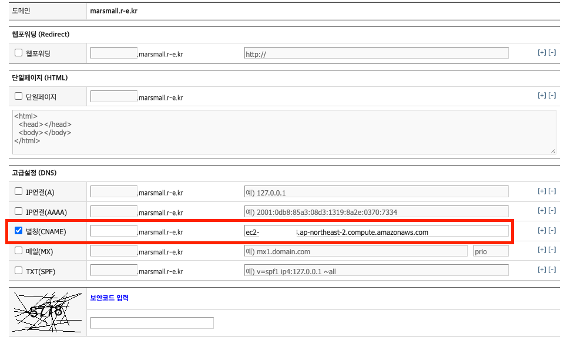
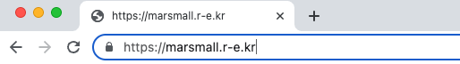

# Amazon Linux2, nginx, HTTPS 적용


AWS EC2 에서 nginx 를 사용할 때 HTTPS 적용 방법입니다.

<br />

<br />

# 준비과정

<br />

## Amazon Linux 2 버전 확인

```shell
$ cat /etc/system-release
Amazon Linux release 2 (Karoo)
```

<br />

<br />

## nginx 설치 및 시작

```shell
# 설치
sudo yum install -y nginx

# 시작
sudo systemctl start nginx
sudo systemctl status nginx
```

<br />

<br />

## 도메인 등록

- 무료로 도메인을 발급받습니다. https://xn--220b31d95hq8o.xn--3e0b707e/ (내도메인.한국)
  - 원하는 도메인을 발급받을 수는 없지만, 테스트용으로는 적절합니다.
  - `marsmall.r-e.kr` 발급 완료
  - 3달이 지나면 만료됩니다.
- 도메인을 실제로 유료 구매를 하시려면, AWS Route 53, gabia, cafe24 등 유료 서비스를 사용하시면 됩니다.

<br />

고급설정 (DNS) 에서 A record (Address) 에 직접 탄력적 IP 주소를 매핑하거나, CNAME (Canonical) record 에 EC2 도메인을 매핑합니다.



<br />

<br />

<br />

# HTTPS 적용

<br />

## nginx 서버 이름 설정

`/etc/nginx/nginx.conf` 에서 위에서 등록했던 도메인 이름을 적어줍니다.

```shell
server {
	server_name marsmall.r-e.kr;
}
```

<br />

설정을 변경하고 적용할 때는 `reload` 를 하면 효율적입니다.

 `restart` 는 nginx 를 종료했다가 다시 시작하여 그 약간의 시간만큼 nginx 가 비활성화됩니다.

반면에 `reload` 는 nginx 기동을 유지한 상태로 설정만 변경합니다.

```shell
sudo systemctl reload nginx
sudo systemctl status nginx
```

<br />

## certbot 으로 https 적용

- Let's Encrypt 에서 SSL 인증서 발급이 무료로 가능합니다.
  - 3개월 마다 연장해야 합니다. (자동화가 가능합니다.)
- `certbot` 으로 Let's Encrypt 로 인증서를 발급이 가능합니다. 
- 또한 `certbot` 으로 웹서버(apache, nginx) 설정이 가능하고, 인증서 갱신 등도 가능합니다.

<br />

### Amazon Linux 2 에 certbot 설치

- 아마존 공식 문서 : https://docs.aws.amazon.com/ko_kr/AWSEC2/latest/UserGuide/SSL-on-amazon-linux-2.html
- 공식문서가 아파치 웹서버를 대상으로 예시가 나와 있어서, `certbot-nginx` 를 추가로 설치해야 합니다.

```shell
sudo wget -r --no-parent -A 'epel-release-*.rpm' http://dl.fedoraproject.org/pub/epel/7/x86_64/Packages/e/
sudo rpm -Uvh dl.fedoraproject.org/pub/epel/7/x86_64/Packages/e/epel-release-*.rpm
sudo yum-config-manager --enable epel*

sudo yum install -y certbot
sudo yum install -y certbot-nginx
```

<br />

### certbot 으로 인증서 발급 및 nginx 설정 자동화

```shell
sudo certbot --nginx
```

- 이렇게 진행하고, 이메일, 동의 여부등을 입력하고 엔터를 눌러 진행합니다.
- 위에서 nginx `server_name` 에 등록한 도메인을 대상으로 인증서를 발급받을 것인지 물어보는데 동의해 줍니다.

<br />

변경된 파일

`/etc/nginx/nginx.conf`

```shell
...
http {
    ...

    server {
        server_name  marsmall.r-e.kr;
        ...

        location / {
          proxy_pass http://localhost:8080;
        }

        ...

        listen [::]:443 ssl ipv6only=on; # managed by Certbot
        listen 443 ssl; # managed by Certbot
        ssl_certificate /etc/letsencrypt/live/marsmall.r-e.kr/fullchain.pem; # managed by Certbot
        ssl_certificate_key /etc/letsencrypt/live/marsmall.r-e.kr/privkey.pem; # managed by Certbot
        include /etc/letsencrypt/options-ssl-nginx.conf; # managed by Certbot
        ssl_dhparam /etc/letsencrypt/ssl-dhparams.pem; # managed by Certbot

    }

    server {
        if ($host = marsmall.r-e.kr) {
            return 301 https://$host$request_uri;
        } # managed by Certbot


        listen       80;
        listen       [::]:80;
        server_name  marsmall.r-e.kr;
        return 404; # managed by Certbot
    }
}
```

- `managed by Certbot` 주석 달린 부분이 certbot 이 자동으로 입력해준 스크립트입니다. 
- 443 포트 (https 기본 포트) 에서 ssl 인증 처리
- ssl 인증서, 비밀키, 그 외 옵션을 자동 생성해줍니다.
- 80 포트 (http 기본 포트) 로 오는 요청은 https 로 리다이렉트 합니다.
  - 그 외 요청은 404 not found 페이지를 반환합니다.

<br />

<br />

접속해보면 자물쇠표시가 뜨면서 성공적으로 https 인증된 것을 확인할 수 있습니다.



http://marsmall.r-e.kr 로 접속해도 https 로 리다이렉트 되는 것을 확인할 수 있습니다.

<br />

<br />

### + 인증서 갱신

- 기본적으로 3개월이 인증서 만료기한인데, certbot 은 인증서 갱신도 지원합니다.

```shell
# 인증서 만료일 확인
sudo certbot certificates

# 인증서 갱신 (--dry-run: 테스트)
sudo certbot renew --dry-run

# 크론탭 편집
sudo crontab -e
# 예시) 매월 1일 00:00 마다 인증서 업데이트
0 0 1 * * sudo certbot renew --renew-hook="sudo systemctl reload nginx"
# 크론 데몬 재시작
sudo systemctl restart crond
```

<br />

<br />

<br />

<br />

<br />

