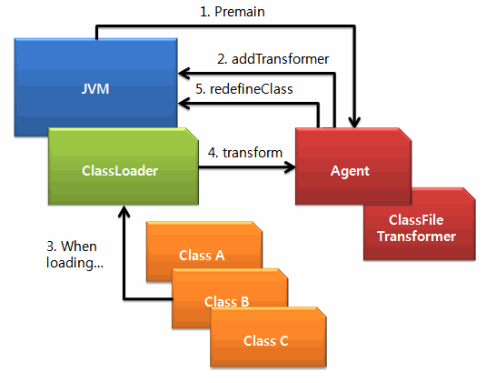

# 자바 애플리케이션 모니터링

<br />

# JavaAgent, Bytecode Instrumentation

애플리케이션 운영시 모니터링이 필요하다.

애플리케이션 모니터링 서비스로 Datadog, Newrelic, Pinpoint 등이 있다.

위와 같은 자바에 모니터링 서비스를 연동할 때는 주로 자바의 javaagent 를 사용한다.

javaagent 는 무엇인지 알아보자.

<br />

<br />

## JavaAgent

- JVM 에서 동작하는 자바 애플리케이션.
- JVM 의 다양한 이벤트를 전달받거나 정보 조회, 바이트코드 제어 등을 API 를 통하여 수행할 수 있다.

```shell
-javaagent:<jarpath>[=<options>]
```

- JVM 의 실행 가능한 최초 진입점인 `main` 메소드를 가로챌 수 있다.
- 실행시간에 동적으로 bytecode 를 조작할 수 있다.
- JVM 과 동일한 Class Loader 내에 로드된다.
- JVM 의 Security Policy, Context 영향을 받는다.
- Java agent 는 Bytecode Instrumentation 을 사용한다.

<br />

<br />

## BCI, Byte Code Instrumentation

- Java 는 Bytecode 라는 기계어를 사용한다. 
- 자바 소스 코드는 컴파일 후 바이트코드로 변환된다.
- Java Bytecode 는 전통적 기계어처럼 OS, HW 의존적이지 않고, JVM 에만 의존적이다.
- 자바의 바이트코드를 순회하기 위해 BCI 는 Visitor Pattern 을 사용한다. 

<br />

## Visitor Pattern

- [Visitor Pattern](https://ko.wikipedia.org/wiki/%EB%B9%84%EC%A7%80%ED%84%B0_%ED%8C%A8%ED%84%B4)
- BCI 의 핵심은 원본 소스를 고치지않고, 새로운 동작을 기존의 구조에 추가하는 것이다.
- 이를 위한 디자인에는 Visitor Pattern 이 잘 어울린다.
  - 기존 구조를 고치지 않고, 새로운 동작을 기존 객체 구조에 추가할 수 있게 된다.
  - 객체지향원칙 중 OCP (개방-폐쇄 원칙)을 적용하는 방법 중 하나이기도 하다.

<br />

## JavaAgent 의 Bytecode Instrumentation 구조

자바는 `java.lang.instrument` 패키지를 제공하고, 이를 사용하여 바이트코드 변환을 허락한다.



1. Java Agent 는 `premain` 메소드를 구현하면, JVM 은 `main` 메소드 실행전 `premain` 을 실행한다.
2. `ClassFileTransformer` 인터페이스를 구현하고, `addTransformer` 로 JVM 에 등록한다.
3. JVM 이 클래스를 로드
4. 이 때,  `ClassFileTransformer` 의 `transform` 메소드를 호출해서 클래스파일의 바이트 코드를 변환한다. 바이트 코드 변환을 위해 다른 라이브러리를 사용한다. (ASM 등)
5. Java Agent 는 필요한 시점에 `redefineClasses` 메소드를 호출해 특정 클래스의 바이트 코드를 런타임에 변경한다.

따라서 바이트코드는 클래스 로딩 때도 바꿀 수 있고, 이후 실행 중 일 때도 바꿀 수 있다. 

<br />

<br />

### JavaAgent 만들기

- [공식문서](https://docs.oracle.com/javase/8/docs/api/java/lang/instrument/package-summary.html)

**1) premain**

아래 메소드에 소스코드를 조작하는 코드를 만들면 된다.

편한 라이브러리를 사용해 만드는 것이 좋다.

```java
// 아래 메소드를 구현한다. JVM 은 이 메소드를 호출한다.
public static void premain(String agentArgs, Instrumentation inst);

// 위 메소드를 구현하지 않았다면, JVM은 아래 메소드를 호출한다.
public static void premain(String agentArgs);
```

<br />

**2) manifest 파일 구성**

JVM 에게 JavaAgent 에 대한 정보를 알려주기 위해 Manifest 파일을 작성해서 jar 파일에 같이 넣어주어야 한다.

manifest 커스터마이제이션 방법으로 아래 플러그인을 참고한다.

- maven : https://maven.apache.org/plugins/maven-jar-plugin/examples/manifest-customization.html
- gradle :https://docs.gradle.org/current/userguide/building_java_projects.html#sec:jar_manifest

`META-INF/MANIFEST.MF` 를 아래와 같도록 변경한다.

```shell
Premain-Class: com.wordbe.MyClass 
Boot-Class-Path: wordbe.jar
Can-Redefine-Classes: true
```

- `Premain-Class`:  premain을 담은 클래스
- `Boot-Class-Path`:  classloader가 로드할 jar파일, 외부 라이브러리 명시, ;로 구분
  - BCI 지원 라이브러리
    - ASM, BCEL, SERF, Javassit, Byte Buddy 등
- `Can-Redefine-Classes` : 런타임에 바이트코드를 변환하게 허락할 것인지 True, False
- 그 외 프로퍼티도 있는데 , 위 공식문서에서 확인하면 된다.

<br />

<br />

### JavaAgent 사용하기

```shell
java -javaagent:wordbe.jar my-application.jar
```

<br />

<br />

<br />

<br />

