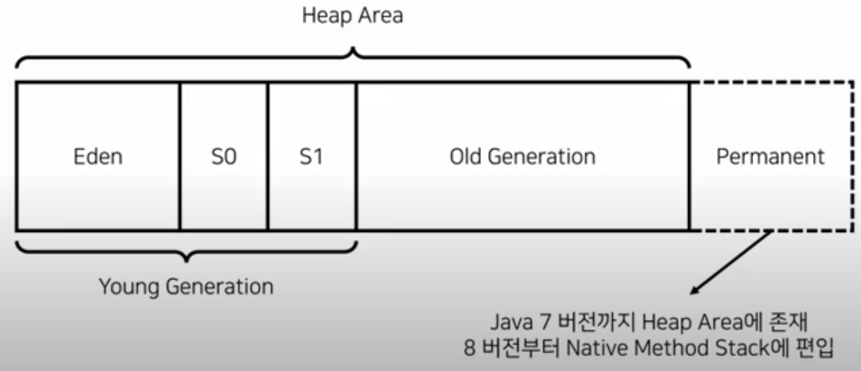
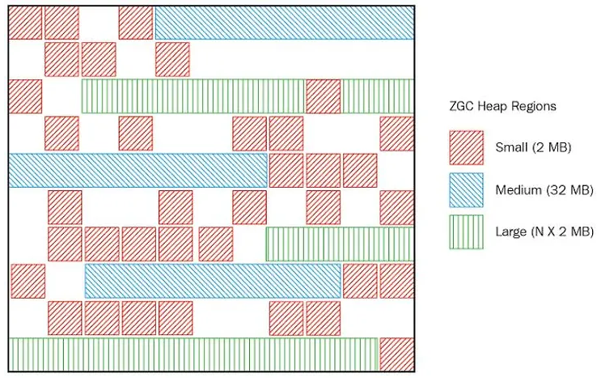

# GC (Garbage Collection)

가비지 콜렉션은 자바가 메모리를 관리하는 기법이다. 

애플리케이션에서 동적으로 할당했던 메모리 (Heap 메모리) 중 사용하지 않는 영역을 정리하는 역할을 한다.

JVM 에서 GC 의 스케쥴링을 담당한다.

 

 

## GC 가설 (weak generational hypothesis)

"대부분 객체는 빨리 수명을 다한다."

- 따라서 젊은 세대, 늙은 세대를 나누어 객체의 수명을 관리를 한다.
- 젊은 세대 중 미사용 객체는 힙 영역에서 삭제
- 늙은 세대 중 미사용 객체는 모았다가 한꺼번에 삭제

 

## GC 알고리즘

Garbage 대상을 식별하고, 힙 메모리에서 제거한다.

 

### 1) Reference Counting Algorithm

- 각 객체마다 참조 개수 (reference count) 를 관리하여, 개수가 0이 되면 GC 수행
- 순환 참조 구조에서 참조 개수가 0 이 되지 않는 문제가 발생.

 

### 2) Mark-and-Sweep Algorithm

- RSet (Root Set) 에서 참조를 추적
- Mark 단계 : Garbage 대상이 아닌 객체를 마킹
- Sweep 단계 : 마킹되지 않은 객체를 삭제
- 마킹 정보를 초기화
- GC 가 동작하고 있을 경우, Mark 작업과 애플리케이션 작업의 충돌을 방지하기 위해 Heap 사용을 제한한다.
- 객체 삭제시, 메모리 공간이 파편화(fragmentation)되어 빈 현상이 발생. 즉 압축 (compaction) 작업이 없어서 OutOfMemory 발생할 수 있음

 

### 3) Mark-and-Compact Algorithm

- Mark, Sweep 이후 Compact 작업까지 진행하여 흩어져있는 메모리를 모아준다.
- 하지만, Compact 작업과 이후 Reference 를 업데이트 하는 작업으로 인해 overhead 발생할 수 있다.

 

### 4) General Algorithm

1. 객체 생성시 Eden 에 존재
2. Minor GC
   - 미사용 객체 제거. 
   - 사용중 객체는 Survivor1(from), Survivor2(to) 영역으로 이동. 둘 중 한 곳만 사용
   - 객체의 크기가 Survior 보다 크면, Old Generation 으로 이동
3. Promotion: Minor GC 반복하면서 Survivor 에서 살아남은 객체들에게 score 를 누적하여 기준 이상이면 Old Generation 으로 이동
4. Full GC (Major GC) : Old Generation 이 어느 정도 커지면, 미사용 객체 모두 제거. 
   - STW (Stop The World) 발생. 객체를 효율적으로 제거하기 위해 JVM 이 잠시 멈춤.

 

 

### Stop the World

- GC 를 수행하기 위해 JVM 이 멈추는 현상을 Stop the world 라 한다.
- GC 관련 스레드를 제외한 모든 스레드가 멈춘다.
- 일반적으로 튜닝은 Stop the world 를 최소화 하는 것을 의미한다.

 

 

## GC 종류

 

### Serial GC

- 하나의 CPU 로 Young, Old Generation 을 연속으로 처리
- Mark-and-Compact 알고리즘 사용 (GC 수행시 STW 발생)

 

### Parallel GC

- **java 7, 8** 에서 default GC
- GC 작업을 병렬로 처리하여 비교적 STW 시간이 짧음: GC 진행동안 다른 CPU 가 대기 상태인 것을 최소화
- JVM option : `-XX:+UseParallelGC`

 

### CMS GC

- Concurrent Mark-Sweep GC
- 애플리케이션의 스레드와 GC 스레드가 동시에 실행되어 STW 를 최소화
- Compact 작업이 없다는 것이 Parallel GC 와 차이

 

### G1 GC

- Garbage First GC
- **java 9~** default GC (JVM 모드마다 다를 수 있음)
- JVM option: `-XX:+UseG1GC`
- 큰 메모리에서 사용하기 적합.
- 대규모 Heap 사이즈에서 짧은 GC 시간 (주로 짧은 STW) 을 보장
- **전체 Heap 영역을 Region 으로 분할하여 상황에 따라 역할을 동적으로 부여**
  - Young Generation(Eden, Survivor), Old Generation 구분 없이 힙 메모리를 동적으로 사용

 

### ZGC

- ZPage 영역을 사용하여, 정지 시간(STW)이 최대 10ms 를 초과하지 않도록 설계
  - 힙 사이즈가 크고, 빠른 응답 시간을 필요로 하는 서버 애플리케이션에 사용하기 좋다.
- G1 GC 는 Region 크기가 고정인 반면, ZPage 는 2MB 배수로 동적으로 운영된다.
- **Heap 크기가 증가하더라도 정지 시간이 증가하지 않음**.

 

ParallelGC, CMSGC, G1GC 가 주로 사용되고, ZGC 도입 가능

 
