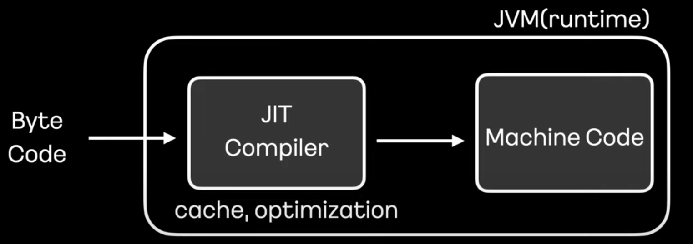
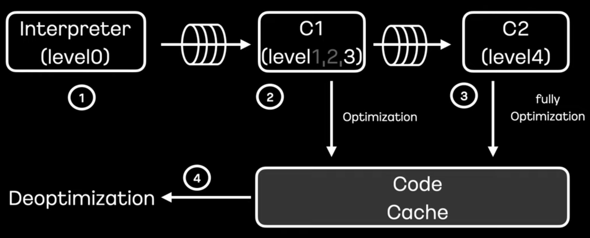

# JIT, AOT Compiler


자바는 컴파일을 하면, `.java` 코드가 바이트코드 (`.class`) 로 변환된다.

변환된 바이트코드들을 실행가능한 파일로 모아둔 것이 `.jar` 파일이다.

`java -jar` 명령어를 통해 위 jar 파일을 실행시키면 (Java Runtime Enviornment 에 적재) 런타임에서는 `JIT` 컴파일러를 통해 기계어 (Native code) 로 변환된다. 

자바는 절반은 바이트코드로 컴파일하고, 절반은 런타임에서 바이트코드를 해석하는 인터프리터 방식을 사용한다고 할 수 있다.

(C/C++, Go, Rust 는 컴파일 단계에서 소스코드를 바로 모두 기계어로 바꾸어 준다. 대신 빌드 환경의 CPU 아키텍처 환경에 종속적이므로, 다른 아키텍처에서 실행하기위해서는 빌드를 다시해야하는 단점이 존재한다.)


<br />

모든 바이트 코드를 바로 기계어 (바이내리 코드)로 바꿔주면 좋겠지만, 컴파일 최적화를 위해서는 프로세서와 메모리 (코드 캐시라 함) 를 사용해야 하고, 그 시간이 얼마나 걸릴지 장담할 수 없다. 

따라서 바이트코드를 해석하며 컴파일을 동시에 하는 절충안으로 JIT 컴파일러가 만들어졌다.

JIT 컴파일러는 무엇인지, 컴파일러에 대해 알아보자.

<br />

<br />

<br />

## JIT 컴파일러



- Just In Time Compilation
- Java HotspotVM (Oracle)의 기본설정.
- 런타임에 java 바이트코드를 기계어로 변환한다. 즉 동적 컴파일을 함.
- java 메소드를 미리 수천번 실행하여 워밍업한다. 이를 통해 캐시에 정보를 저장하여 컴파일러가 전체 클래스 구조를 알고 최적화할 수 있다.
- JIT 컴파일러는각 메소드마다 호출 횟수를 관리하여, 일정 횟수이상이면 JIT 컴파일을 수행한다. 자주 사용되는 메소드는 런타임 직후 컴파일되고, 잘 사용되지 않는 메소드는 나중에 컴파일되거나, 전혀 컴파일 되지 않을 수도 있다.
- JVM Option 을 통해 컴파일 조건을 제어할 수 있다.
  - `-XX:ReservedCodeCacheSize` : 최대 코드 캐시 사이즈
  - `-XX:InitialCodeCacheSize` : 최초 코드 캐시 사이즈
  - `-XX:CompileThreadhold` : 컴파일 임계치 설정, 기본 10,000 (서버 컴파일러)


### JIT 동작

- Method 단위로 컴파일 진행. 한 메소드에서 모든 바이트코드를 native code로 번역 (level 0)

- 후속 작업을 위해 최적화 정보 Profiling 

- Tiered compilation 단계별 컴파일 최적화 진행

  - C1 compilation: 간략한 최적화

    - level 1: simple
    - level 2 : limited
    - level 3 : full, 프로파일링 모드

  - C2 compilation: 최대 최적화(level 4). 코드 캐시에 저장하고 활용함으로써 코드의 실행속도를 높임

    

<br />

<br />

## 컴파일러가 하는 일

<br />

### inling (인라이닝)

- 메소드를 효율적으로 사용할 수 있도록, 같은 의미를 지니지만 효율적인 구성으로 바꿈
- 예를 들어 자바의 getter, setter 메소드는 생각보다 오버헤드가 큰데, 이를 아래와 같은 코드로 변환한다.

```java
Cash c = getCash();
c.setPrice(c.getPrice() * 2);

// inline
c.price = c.price * 2;
```

- 자주 호출되는 메소드를 대상을 주로 인라인화한다.
- 자주 호출되지 않는다면 특정 바이트보다 작으면 인라인화된다.
- JIT 컴파일러가 가장 먼저 적용하는 최적화이므로 관문 최적화라고도 불린다.
- JVM Option 으로 인라이닝 조건을 조절할 수 있다.

<br />

### escape analysis (탈출 분석)

- 객체가 사용되는 스코프를 분석해서, 특정 스코프 안이라면 최적화를 한다.
- 특정 스코프 안에 있다면, 동기화 락을 걸지 않아도 되고, 객체를 힙에 할당하지 않고 로컬 스택에 쌓아도 된다.
- 탈출 분석으로 인해 느려지는 경우도 발생할 수 있다.

<br />

### loop unrolling (반복문 펼치기)

- 반복문에서는 기본적으로 반복 조건 검사후, jump 하는 오버헤드가 있어서 이를 단순하게 직접 코드를 추가하는 방식으로 펼친다.
- 아래는 단순 예시이다.

```java
for (int i = 0; i < 10; i++) {
  process();
}

// loop unrolling
for (int i = 0; i < 2; i++) {
  process();
  process();
  process();
  process();
  process();
}
```

<br />

<br />

## AOT

- Ahead Of Time Compilation, 소스코드를 미리 컴파일
- GraalVM 에서 지원
- 빌드타임에 java 바이트코드를 기계어로 변환한다.
- 애플리케이션 실행시 적은 오버헤드로 빠르게 실행된다.
- 워밍업 없어서 초기 실행 더 빨라짐

자바도 C/C++, Go, Rust 등 처럼 소스코드를 바로 기계어로 번역하고자 하는 시도로 AOT 컴파일러를 만들었다.

하지만 JAOT 를 아직 안정적으로 운영한 선례를 찾지 못해 일단 보류.

<br />

<br />

<br />

<br />

<br />
