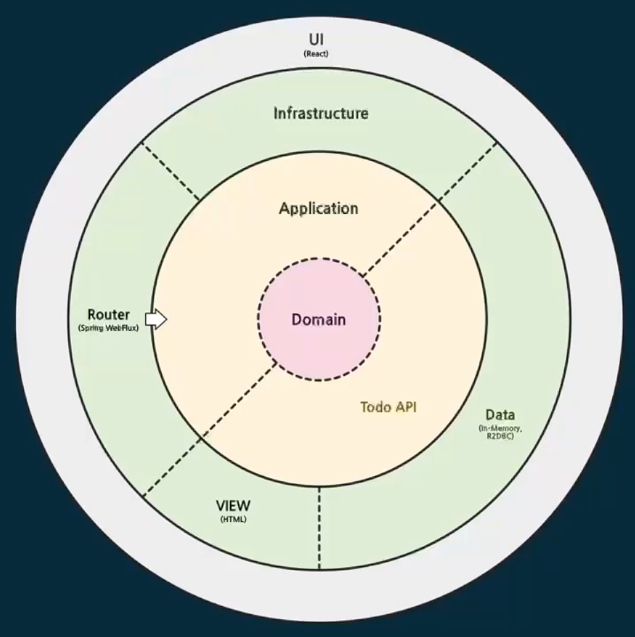

# 코틀린 멀티플랫폼

 

애플리케이션 아키텍처

- 클린 아키텍처 사용
- 외부에서 내부로 접근하는 의존관계만 허용

  

모듈 구조와 소프트웨어 스택

- core (Common Kotlin)
  - kotlinx.coroutines
  - kotlinx.serialization
  - ktor-client
  - kotling-logging
- client (Kotlin/JS)
  - react
  - emotion
  - mui
  - kotlinx-html-js
- server (Kotlin/JVM)
  - spring-webflux
  - spring-data-r2dbc
  - kotlinx-html-jvm

 

# jsMain

- 코틀린 코드를 컴파일 하면 `main.js` 가 나오도록 구성
- 이렇게 번들링된 js 파일은 `jvmMain` 서버에서 바로 사용할 수 있음

