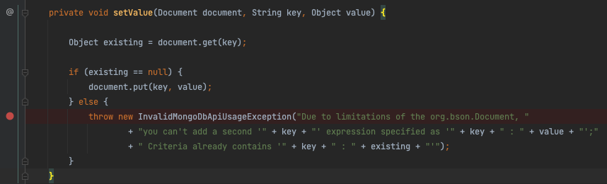

# Spring Data MongoDB - Criteria already contains 문제


MongoRepository 에서 바로 아래와 같은 인터페이스를 만들고 사용하면, 아래와 같은 예외가 발생합니다.

```java
public interface TodoRepository extends MongoRepository<Todo, String> {

    List<Todo> findAllByCreatedAtGreaterThanEqualAndCreatedAtLessThanEqual(LocalDateTime startAt, LocalDateTime endAt);
}
```

`startAt <= createdAt <= endAt` 인 부분만 가져오고 싶은 쿼리였는데요.

`findByCreatedAtBetween` 을 사용하면, `startAt < createdAt < endAt` 으로 exclusive 한 쿼리가 만들어지므로, 위와 같은 방법을 택했었습니다.

<br />

```shell
Due to limitations of the org.bson.Document, you can't add a second 'createdAt' expression specified as 'createdAt : Document{{$lte=2023-03-10T18:33}}'; Criteria already contains 'createdAt : Document{{$gte=2023-01-01T00:00}}'
org.springframework.data.mongodb.InvalidMongoDbApiUsageException: ...
```

에러 메시지를 읽어보면, 문제는 간단합니다. 

첫번째 createdAt 조건을 가진 `Criteria` 가 존재하기 때문에, 두 번째 createdAt 표현문은 추가할 수 없다는 것입니다.

Spring Data MongoDB 가 단순 [쿼리메소드](https://docs.spring.io/spring-data/mongodb/docs/current/reference/html/#repositories.query-methods)로는 위 문법을 지원하지 않아 보입니다.


<br />

4가지 해결방법을 찾았는데, 상황에 맞는 쿼리를 사용하면 됩니다.

## 1. 쿼리메소드 사용 (with Range)

```java
public interface TodoRepository extends MongoRepository<Todo, String> {
	List<Todo> findAllByCreatedAtBetween(Range<LocalDateTime> createdAt);
}
```

Spring Data MongoDB [공식문서](https://docs.spring.io/spring-data/mongodb/docs/current/reference/html/#mongodb.repositories.queries) 에서 lower / upper bounds 를 키워드로 검색하면, 해법이 제시되어 있습니다.

위처럼 쿼리메소드를 정의한 뒤, 아래 처럼 사용하면 됩니다.

```java
@Test
void findAllByCreatedAtBetween() {
  List<Todo> todos = todoRepository.findAllByCreatedAtBetween(Range.closed(LocalDateTime.of(2023, 1, 1, 0, 0, 0), LocalDateTime.of(2023, 3, 10, 18, 33, 0)));

  assertThat(todos).isNotEmpty();
}
```

테스트코드를 실행하면, 테스트가 완료되고 아래와 같은 쿼리가 실행된 것을 볼 수 있습니다.

```shell
{ "createdAt" : { "$gte" : { "$date" : "2022-12-31T15:00:00Z"}, "$lte" : { "$date" : "2023-03-10T09:33:00Z"}}}
```

<br />

참고로 MongoDB 로깅을 콘솔에서 보려면 `application.yml` 에 아래 설정을 추가해주시면 됩니다.

```yaml
logging:
  level:
    org:
      springframework:
        data:
          mongodb:
            core:
              MongoTemplate: DEBUG
```

<br />

<br />

## 2. Query 사용 or Aggregation 사용

나머지 세가지 방법은 비교가 용이하도록 한 번에 보여드리겠습니다.

```java
...
import org.springframework.data.mongodb.core.MongoTemplate;
import org.springframework.data.mongodb.core.aggregation.Aggregation;
import org.springframework.data.mongodb.core.query.Criteria;
  
import static org.springframework.data.mongodb.core.aggregation.Aggregation.match;
import static org.springframework.data.mongodb.core.aggregation.Aggregation.newAggregation;
import static org.springframework.data.mongodb.core.query.Criteria.where;
import static org.springframework.data.mongodb.core.query.Query.query;

@Repository
@RequiredArgsConstructor
public class TodoCustomRepository {
    private final MongoTemplate mongoTemplate;

    public List<Todo> findAllByCreatedAtBetween(LocalDateTime startAt, LocalDateTime endAt) {
        return mongoTemplate.find(query(where("createdAt").gte(startAt).lte(endAt)), Todo.class);
    }

    public List<Todo> findAll2ByCreatedAtBetween(LocalDateTime startAt, LocalDateTime endAt) {
        return mongoTemplate.find(query(
                new Criteria().andOperator(
                        where("createdAt").gte(startAt),
                        where("createdAt").lte(endAt)
                )
        ), Todo.class);
    }

    public List<Todo> findAll3ByCreatedAtBetween(LocalDateTime startAt, LocalDateTime endAt) {
        Aggregation aggregation = newAggregation(
                match(new Criteria().andOperator(
                                where("createdAt").gte(startAt),
                                where("createdAt").lte(endAt))
                )
        );

        return mongoTemplate.aggregate(aggregation, "todo", Todo.class).getMappedResults();
    }
}
```

3개의 메소드 모두 정상 작동 됩니다.

<br />

<br />

### 2-1 Query, Criteria 조합

`findAllByCreatedAtBetween` 은 Query 와 Criteria 를 조합해서 만든 몽고 쿼리입니다.

```java
public List<Todo> findAllByCreatedAtBetween(LocalDateTime startAt, LocalDateTime endAt) {
  return mongoTemplate.find(query(where("createdAt").gte(startAt).lte(endAt)), Todo.class);
}
```

주의해야 할 점은 `where("createdAt").gte(startAt).and("createdAt").lte(endAt)` 처럼 프로퍼티를 중복으로 and 에 넣으면 작동되지 않는다는 것입니다. 



맨 위 오류와 연관된 `org.springframework.data.mongodb.core.query.Criteria` 의 코드인데요. 두 개 이상의 같은 키를 가진 Criteria 가 있다면 예외를 발생시키고 있는 부분입니다.

<br />

<br />

### 2-2 Query, Criteria 조합 (with andOperator)

andOperator 를 사용하면, 두 개 이상의 같은키를 사용해도 예외가 발생하지 않습니다.

```java
public List<Todo> findAll2ByCreatedAtBetween(LocalDateTime startAt, LocalDateTime endAt) {
  return mongoTemplate.find(query(
    new Criteria().andOperator(
      where("createdAt").gte(startAt),
      where("createdAt").lte(endAt)
    )
  ), Todo.class);
}
```

<br />

<br />

### 2-3 aggregation, andOperator 사용

```java
public List<Todo> findAll3ByCreatedAtBetween(LocalDateTime startAt, LocalDateTime endAt) {
  Aggregation aggregation = newAggregation(
    match(new Criteria().andOperator(
      where("createdAt").gte(startAt),
      where("createdAt").lte(endAt))
    )
  );

  return mongoTemplate.aggregate(aggregation, "todo", Todo.class).getMappedResults();
}
```

aggregation, match, andOperator 를 잘 조합하면, 원하는 쿼리를 만들 수 있습니다.

<br />

<br />

마지막으로 세 코드의 테스트 결과와 쿼리 실행 결과를 비교해보겠습니다.

```java
@Test
void findAllByCreatedAtBetween() {
  List<Todo> result = todoCustomRepository.findAllByCreatedAtBetween(LocalDateTime.of(2023, 1, 1, 0, 0, 0), LocalDateTime.of(2023, 3, 10, 18, 33, 0));

  assertThat(result).hasSize(1);
}

@Test
void findAll2ByCreatedAtBetween() {
  List<Todo> result = todoCustomRepository.findAll2ByCreatedAtBetween(LocalDateTime.of(2023, 1, 1, 0, 0, 0), LocalDateTime.of(2023, 3, 10, 18, 33, 0));

  assertThat(result).hasSize(1);
}

@Test
void findAll3ByCreatedAtBetween() {
  List<Todo> result = todoCustomRepository.findAll3ByCreatedAtBetween(LocalDateTime.of(2023, 1, 1, 0, 0, 0), LocalDateTime.of(2023, 3, 10, 18, 33, 0));

  assertThat(result).hasSize(1);
}
```

테스트는 모두 성공적으로 완료되고, 쿼리 실행 결과는 순서대로 아래와 같습니다.

```shell
# findAllByCreatedAtBetween
find using query: { "createdAt" : { "$gte" : { "$date" : "2022-12-31T15:00:00Z"}, "$lte" : { "$date" : "2023-03-10T09:33:00Z"}}} fields: Document{{}} for class: class co.whitetree.javatodo.domain.todo.Todo in collection: todo

# findAll2ByCreatedAtBetween
find using query: { "$and" : [{ "createdAt" : { "$gte" : { "$date" : "2022-12-31T15:00:00Z"}}}, { "createdAt" : { "$lte" : { "$date" : "2023-03-10T09:33:00Z"}}}]} fields: Document{{}} for class: class co.whitetree.javatodo.domain.todo.Todo in collection: todo

# findAll3ByCreatedAtBetween
Executing aggregation: [{ "$match" : { "$and" : [{ "createdAt" : { "$gte" : { "$date" : "2022-12-31T15:00:00Z"}}}, { "createdAt" : { "$lte" : { "$date" : "2023-03-10T09:33:00Z"}}}]}}] in collection todo
```

<br />

상황에 맞는 쿼리를 잘 선택하셔서 사용하시길 바랍니다.

감사합니다.


<br />

<br />

<br />

<br />

<br />

